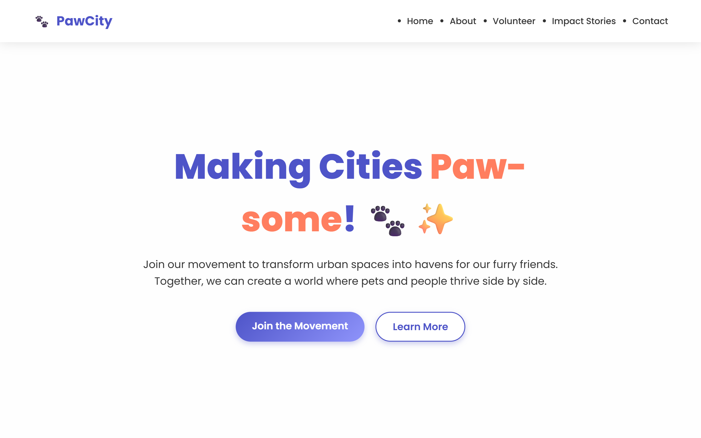

# 🐾 Pet-Friendly City – Landing Page

**Making Cities Paw-some!** ✨

---

## 🚀 Live Demo

Check out the live website here:  
[🌐 View Live Demo](https://petfriendlycity.netlify.app/)

 <!-- Replace with actual screenshot path -->

---

## 📖 About the Project

The **Pet-Friendly City Landing Page** is a vibrant, responsive, and user-friendly website created to promote a city-wide campaign encouraging pet-friendly spaces and community volunteering. The page invites users to join the movement, sign up, and be inspired by real impact stories.

---

## 🎯 Features

- ✨ Bold hero section with a slogan and CTA buttons
- 📌 Smooth navigation with working anchor links
- 📝 Volunteer sign-up form
- 🐾 Impact Stories section with placeholders
- 🎨 Clean, modern design with animations
- 📱 Fully responsive for mobile and desktop
- 🐶 Hover effects and pet-themed emojis for fun user interaction

---

## 🛠️ Tech Stack

- **HTML5** – Semantic structure
- **CSS3** – Styling, layout, responsiveness, animations
- **JavaScript** – For interactivity

---

## 📦 Installation

1. Clone the repo:

   ```bash
   git clone https://github.com/swayamDev/pet-friendly-city-landing-page.git
   ```

2. Navigate to the project folder:

   ```bash
   cd pet-friendly-city-landing-page
   ```

3. Open `index.html` in your browser to view locally.

---

## ▶️ Usage

- Customize text/images in the HTML file
- Adjust styling via `style.css`
- Add or modify JS logic in `script.js` if needed
- Deploy using Netlify, Vercel, or GitHub Pages

---

## 🤝 Contributing

Contributions are welcome!

1. Fork the project
2. Create a new branch (`git checkout -b feature/your-feature`)
3. Commit your changes (`git commit -m 'Add feature'`)
4. Push to the branch (`git push origin feature/your-feature`)
5. Open a Pull Request

---

## 📄 License

This project is licensed under the **MIT License** – for educational and portfolio use only.

---

## 📬 Contact

**Swayam Swarup Panda**  
📧 swayamcoder@gmail.com

---

## 🎉 Acknowledgements

- Design inspiration from pet community campaigns
- Icons and emojis from [Emojipedia](https://emojipedia.org)
- Deployed via [Netlify](https://netlify.com)

---

## 🔮 Future Work

- 🐱 Add real impact stories and testimonials
- 🐕 Integrate backend for volunteer form submissions
- 🐾 Include a working pet adoption carousel
- 📊 Add analytics and real-time data dashboard

---
